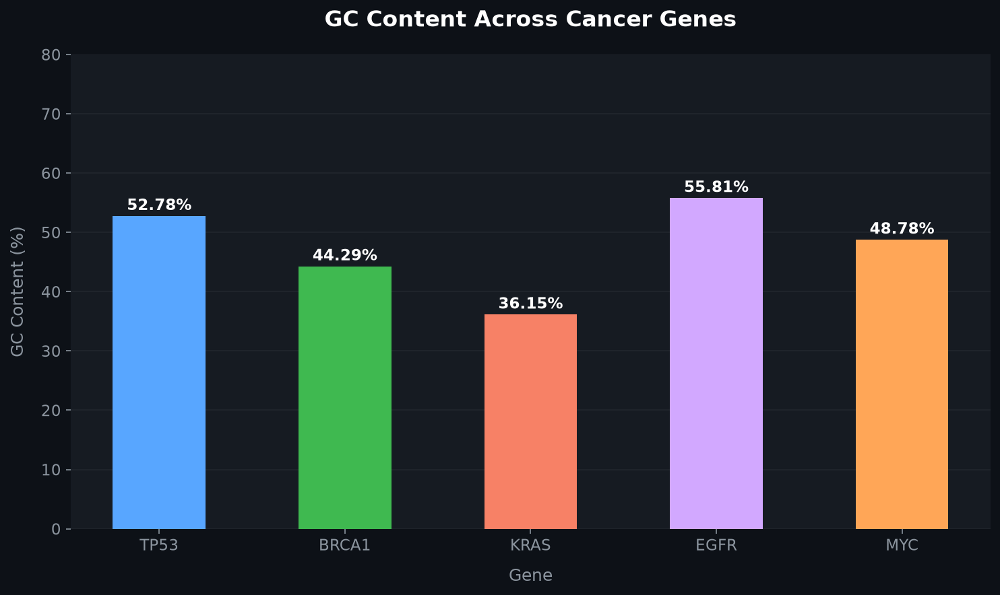

# biotech-tools


A Python-based bioinformatics pipeline for gene sequence analysis, protein translation, and basic ORF detection using real NCBI data.

---

##  What this project does

This project explores how computational biology works in practice — not just theory.

Starting from a gene name (e.g. TP53, BRCA1), the pipeline:

* Fetches real nucleotide sequences from NCBI
* Filters for biologically relevant RefSeq (NM_) mRNA sequences
* Analyzes nucleotide composition (A, T, G, C)
* Calculates GC content
* Detects start and stop codons
* Identifies the longest open reading frame (ORF)
* Translates DNA into a realistic protein sequence

Everything here is built step-by-step while learning both Python and bioinformatics concepts.

---

##  Features

*  Gene search using NCBI Entrez API
*  Automatic RefSeq (NM_) filtering
*  Sequence analysis (length, GC%, nucleotide counts)
*  Start/stop codon detection
*  Longest ORF detection (biologically meaningful protein)
*  CLI support for single and multiple genes
*  FASTA file export

---

## Project structure
```
biotech-tools/
├── data/ # Saved FASTA sequences
│ ├── BRCA1.fasta
│ ├── KRAS.fasta
│ └── TP53.fasta
├── scripts/
│ ├── cli.py # Main CLI tool
│ ├── fetch_gene.py # Basic gene fetch script
│ ├── analyze.py # Sequence analysis + ORF translation
│ ├── p53_analyzer.py # TP53-specific analysis
│ └── kras_analyzer.py # KRAS mutation analysis
├── src/
│ └── ncbi/
│ ├── fetch.py # Fetch sequences from NCBI
│ └── search.py # Search gene IDs from NCBI
├── README.md
├── requirements.txt
└── .gitignore
```
---

##  Installation

```bash
pip install -r requirements.txt
```

---

##  Usage

### CLI (recommended)

Fetch and analyze genes:

```bash
python -m scripts.cli --gene TP53
python -m scripts.cli --genes TP53 KRAS BRCA1
```

---

## Visualizations

### GC Content Comparison Across Cancer Genes



### Basic scripts

Fetch gene manually:

```bash
python -m scripts.fetch_gene
```

Run analysis:

```bash
python -m scripts.analyze
```

---

##  Example output

```
Searching for TP53...
Selected RefSeq: NM_001407264.1

Length: 2522 bp  
GC Content: 52.78%

Protein (longest ORF):
MEPCISQTAFRVTAMEEPQSDPSVEPPLSQETFSDLWKLLPENNVLSPL...
```

---

##  What I learned

* Working with real biological data (NCBI)
* API usage in Python (Biopython Entrez)
* Sequence analysis and interpretation
* Open Reading Frame (ORF) detection
* Building CLI-based tools
* Structuring a real-world project

---

## Author

Aadya — BSc Biotechnology student
Exploring the intersection of biology, data, and code

GitHub: https://github.com/aadya2909
